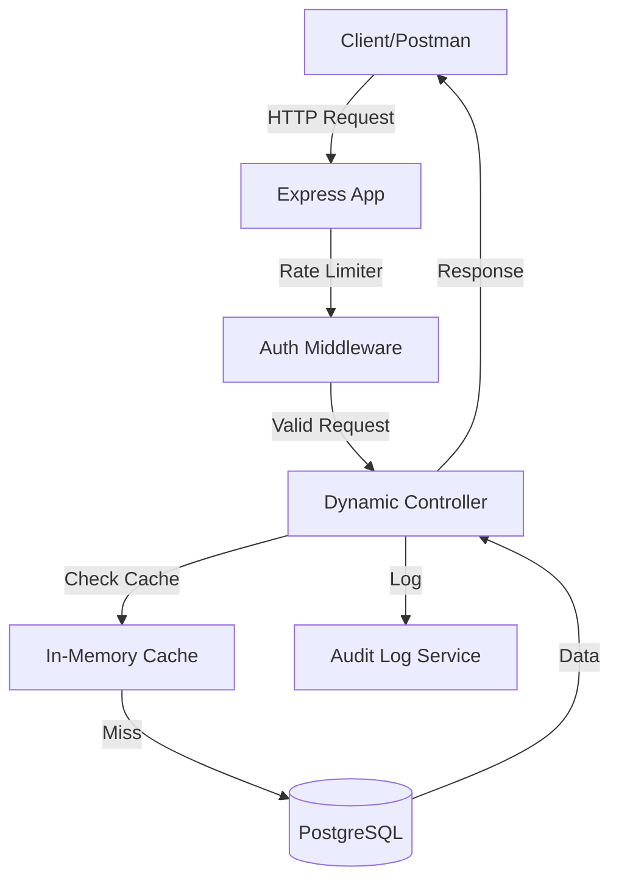

# 📝 Smart API Hub

Smart API Hub là một REST API Platform linh hoạt, được xây dựng bằng **Node.js** và **TypeScript**. Hệ thống có khả năng tự động sinh ra các endpoint CRUD đầy đủ từ một file cấu hình `schema.json`.

## 🛠 Tech Stack

- **Runtime:** Node.js (≥ 20)
- **Language:** TypeScript (Strict Mode)
- **Framework:** Express.js
- **Database:** PostgreSQL & Knex.js
- **Validation:** Zod
- **Authentication:** JWT & Bcrypt
- **Testing:** Vitest & Supertest
- **Containerization:** Docker & Docker Compose
- **Documentation:** Swagger UI

## 🏗 Architecture Diagram



## 🚀 Hướng dẫn cài đặt và chạy

### 1. Yêu cầu hệ thống

- Docker & Docker Compose
- Hoặc Node.js ≥ 20 và PostgreSQL ≥ 15

### 2. Chạy bằng Docker (Khuyên dùng)

```bash
docker compose up --build
```

Hệ thống sẽ khởi chạy tại: `http://localhost:3000`

### 3. Chạy trực tiếp (Local)

1. Cài đặt dependencies: `npm install`
2. Tạo file `.env` từ `.env.example` và cấu hình `DATABASE_URL`
3. Chạy dev mode: `npm run dev`

## 📖 Tài liệu API

Sau khi khởi chạy, bạn có thể truy cập Swagger UI tại:
`http://localhost:3000/docs`

### Các tính năng chính:

- **Auto-Migration:** Tự động tạo bảng từ `schema.json`.
- **Dynamic CRUD:** Tự động sinh route cho mọi resource trong schema.
- **Advanced Query:** Hỗ trợ lọc (`_gte`, `_lte`, `_ne`, `_like`), tìm kiếm (`q`), phân trang (`_page`, `_limit`), và sắp xếp (`_sort`, `_order`).
- **Relationships:** Hỗ trợ lấy dữ liệu liên quan qua `_expand` (cha) và `_embed` (con).
- **Authentication:** Bảo vệ các route Write (POST/PUT/PATCH) và chỉ Admin mới được DELETE.
- **Bonus Features:**
  - Rate Limiting (100 req/min).
  - Response Caching (30s TTL).
  - Audit Logging (Lưu vết thao tác vào bảng `audit_logs`).

## 🧪 Chạy Test

```bash
npm test
```
